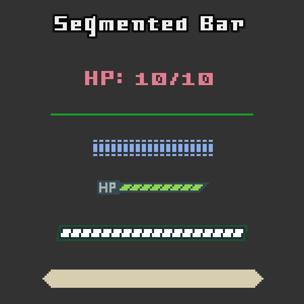

# godot-segmented-bar
A SegmentedBar Node to build health and other resource bars with in Godot 4

## Installation
- Add the content of the addons directory into the `res://addons` directory of your project
- Enable the plugin in your project settings

## Usage
The SegmentedBar node contains functions and variables to directly control the behavior of the bar. These functions can be encapsulated into higher level functions such as `heal` and `damage` that can be called from your UI as seen in the examples folder.
